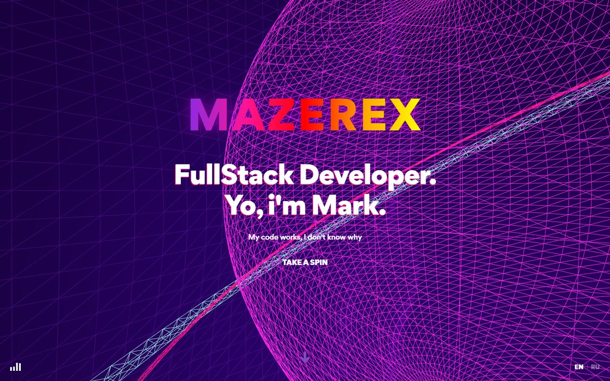
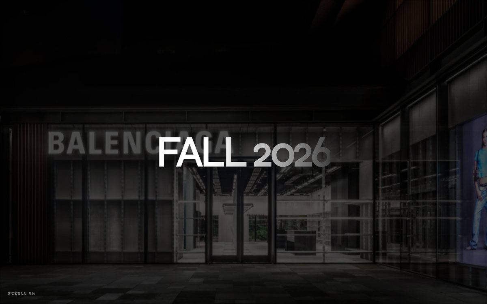

<a href="#russian">Русская версия ↓</a>

# Hi! I'm MAZEREX

My name is Mark, I'm a fullstack developer. I build websites and Telegram bots end to end: from the interface and business logic to the database and server deployment. I care about understanding how things work under the hood instead of just gluing ready-made pieces together, so my projects come with a thought-out architecture, proper database migrations and deployments that survive a server reboot.

I take orders directly. Message me on Telegram with your idea and I'll tell you how I'd build it, how long it takes and what it costs. I'm also part of the [ALIEN Studio](https://alien-studio.com) team.

## Find me

 &nbsp;Telegram: [@asyncDevXD](https://t.me/asyncDevXD)

 &nbsp;Website: [mazerex.fun](https://www.mazerex.fun)

## Stack

 

## Projects 3

<table>
  <tr>
    <td align="center" width="50%">
      
       <b>MazerexDev</b>
       my portfolio, a site built as a 3D scene with React and three.js
       <a href="https://github.com/mazerexzy/MazerexDev">Code</a> · <a href="https://www.mazerex.fun">Live</a>
    </td>
    <td align="center" width="50%">
      
       <b>balenciaga-lending</b>
       a concept store landing page with animations and 3D
       <a href="https://github.com/mazerexzy/balenciaga-lending">Code</a> · <a href="https://mazerexzy.github.io/balenciaga-lending/">Demo</a>
    </td>
  </tr>
</table>

**[Narodniy Prognozist](https://github.com/mazerexzy/narodniy-prognozist)**. A Telegram bot for match prediction tournaments with sign-up, 1/X/2 picks, a leaderboard, a tournament archive and an admin panel. Made to order.

---

<b>Русская версия</b>

 

# Привет! Я MAZEREX

Меня зовут Марк, я fullstack разработчик. Делаю сайты и Telegram ботов целиком: от интерфейса и логики до базы данных и деплоя на сервер. Мне важно понимать, как технологии работают изнутри, а не просто собирать проект из готовых кусков. Поэтому у меня продуманная архитектура, нормальные миграции базы и деплой, который переживает перезагрузку сервера.

Заказы беру напрямую. Напишите в Telegram с идеей, расскажу, как бы я это сделал, сколько займёт времени и сколько будет стоить. Также состою в команде [ALIEN Studio](https://alien-studio.com).

## Где меня найти

 &nbsp;Telegram: [@asyncDevXD](https://t.me/asyncDevXD)

 &nbsp;Сайт: [mazerex.fun](https://www.mazerex.fun)

## Проекты 3

<table>
  <tr>
    <td align="center" width="50%">
      
       <b>MazerexDev</b>
       моё портфолио, сайт с 3D сценой на React и three.js
       <a href="https://github.com/mazerexzy/MazerexDev">Код</a> · <a href="https://www.mazerex.fun">Сайт</a>
    </td>
    <td align="center" width="50%">
      
       <b>balenciaga-lending</b>
       концепт лендинга магазина с анимациями и 3D
       <a href="https://github.com/mazerexzy/balenciaga-lending">Код</a> · <a href="https://mazerexzy.github.io/balenciaga-lending/">Демо</a>
    </td>
  </tr>
</table>

**[Народный прогнозист](https://github.com/mazerexzy/narodniy-prognozist)**. Telegram бот для турнира прогнозов на матчи с регистрацией, ставками П1/Х/П2, рейтингом, архивом турниров и админкой. Делал на заказ.

